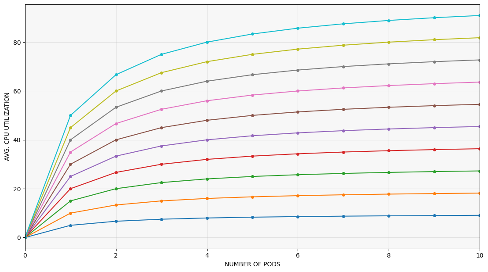

## TABLE OF CONTENTS
1. [Program the Yolo processor](#)
    1. [Define the default processor params](#)
2. [Create a standalone Docker image](#)
3. [Make the Docker image publically available](#)
4. [Configure the Kubernetes deployment](#)
    1. [Define the Docker image location](#)
    2. [Override the Docker image args](#)
    3. [Define min/max resource thresholds for pods](#)
    4. [Define the min/max pod count](#)
    5. [Define when pods should be created/destroyed](#)
    6. [Define how often Kubernetes is allowed to scale up/down](#)
5. [Initialize Kafka topics & deploy consumer pods](#)

## 1. PROGRAM THE YOLO PROCESSOR

- Relevant files:
    - Main file: [`/app/processor.py`](/app/processor.py)
    - Kafka clients: [`/app/utilz/kafka_utils.py`](/app/utilz/kafka_utils.py)
    - Yolo models: [`/app/models`](/app/models)
- The python program loop:
    1. Load a specified `Yolo` model from the `/models` directory.
    2. Subscribe to a Kafka topic (`yolo_input`) and extracts data from it.
        - Many programs can be subscribed from the same topic.
        - They can extract data in parallel from different topic partitions.
    3. The extracted data is converted to a `image`, which is fed to the `Yolo` model.
    4. If toggled, the `Yolo` inference statistics are sent to another Kafka topic (`yolo_output`).
    5. Repeat until manually killed.


#### 1.1. DEFINE PROCESSOR PARAMS
```bash
args = {

    # SPECIFY DEFAULT VALUES
    # THESE ARE MODIFIABLE FROM THE KUBERNETES DEPLOYMENT FILE
    'model': os.environ.get('YOLO_MODEL', 'custom-750k'),
    'validate_results': True if os.environ.get('VALIDATE_RESULTS', 'TRUE') == 'TRUE' else False,
    
    # STATIC KAFKA TOPIC NAMES
    'kafka_input': 'yolo_input',
    'kafka_output': 'yolo_output',
}
```

## 2. CREATE A STANDALONE DOCKER IMAGE

- Script location: [`./01_build_and_test.sh`](01_build_and_test.sh)
- All `Kubernetes` pods eventually die or reboot, intentionally or otherwise.
- All your `Yolo processors` should therefore use be identical in structure.
- We accomplish this requirement by wrapping our python program in a `Docker Image`.
- There are two necessary steps:
    - Fill your yolo processor's `pip` dependencies into [`app/requirements.txt`](app/requirements.txt)
    - Configure the `Dockerfile` in [`consumer.Dockerfile`](consumer.Dockerfile)
        - `Python:3.8` is a very heavy image base, find something lighter?
        - `Yolo` requires `Pytorch`, which is finnicky to install.
- Then run the following commands:

```bash
# BUILD THE DOCKER IMAGE
docker build --no-cache -t workload_consumer -f consumer.Dockerfile .

# MAKE SURE THAT THE IMAGE WORKS
docker run workload_consumer
```

## 3. MAKE THE DOCKER IMAGE PUBLICALLY AVAILABLE

- Script location: [`./02_refresh_image.sh`](02_refresh_image.sh)
- Kubernetes is distributed, therefore your docker images must be publically available to all cluster nodes for deployments to work.
    - Setting up a `local image repository` is possible, but the available docker images were too buggy and dysfunctional at the time to bother with.
    - I chose to use `Docker Hub` instead as it is very straight forward.
- Every time you update your `Yolo processor`, you must also build and push the new image to Docker Hub.

```bash
# LOGIN TO DOCKER HUB ONCE
# SUBSEQUENT SCRIPT LAUNCHES WILL REMEMBER YOUR ID
docker login
```

```bash
# SET YOUR GIT USERNAME
MY_GIT_USERNAME="wickstjo"

# BUILD THE DOCKER IMAGE
docker build --no-cache -t workload_consumer -f consumer.Dockerfile .

# TAG & UPLOAD THE IMAGE TO DOCKER HUB REGISTRY
docker tag workload_consumer:latest $MY_GIT_USERNAME/workload_consumer:latest
docker push $MY_GIT_USERNAME/workload_consumer:latest
```

## 4. CONFIGURE THE KUBERNETES DEPLOYMENT

- File location: [`yolo_deployment.yaml`](yolo_deployment.yaml)
- Now that we have a `Docker` image, we need to configure how Kubernetes should treat it.
- Here are some central points of interest:

#### 4.1. DEFINE THE DOCKER IMAGE
```yaml
# DEFINE THE DOCKERHUB LOCATION OF YOUR IMAGE
image: wickstjo/workload_consumer:latest

# FORCES THE KUBE NODE TO PULL THE NEWEST VERSION OF THE IMAGE
# IF IT DOESNT ALREADY EXIST LOCALLY
imagePullPolicy: Always
```

#### 4.2. OVERRIDE YOLO PROCESSOR ARGS

```yaml
# VALIDATE YOLO RESULTS OR NOT?
-   name: VALIDATE_RESULTS
    value: "FALSE"

# DEFINE WHAT YOLO MODEL TO USE
-   name: YOLO_MODEL
    value: "custom-20k"
    # value: "custom-120k"
    # value: "custom-300k"
    # value: "custom-750k"
    # value: "yolov5n"
    # value: "yolov5m"
    # value: "yolov5s"
```

- Overrides the default values in [`/app/processor.py`](/app/processor.py)
- Makes it easy to dynamically swap models or debug inference results.
    - Use the capital string representation of either `TRUE` or `FALSE`.
    - Use the string name of the models in `app/models`, no suffix needed.

#### 4.3. DEFINE MIN/MAX RESOURCE THRESHOLD PER POD

```yaml
# MAXIMUM RESOURCE LIMIT FOR POD
# 1000m ~= 1 CPU CORE
limits:
    cpu: 1000m

# MINIMUM RESOURCE REQUIREMENT FOR POD
requests:
    cpu: 1000m
```

- Kubernetes will create new pods as long as the cluster's remaining resource is larger than the next pod's minimum threshold.
- The maximum limit can be completely unrealistic and only exists to intentionally throttle pods. A ridiculously high maximum limit practically just means "make pods until the cluster runs out of resources".
    - There is a `kubectl` command to investigate exactly how many millicores a pod is currently utilizing (todo: can't remember the cmd).
    - Use it for debugging.
- During experiments:
    - Low thresholds have yielded unstable results
    - High values (2K+) have been quite stable.
    - Difficult to trace why.

#### 4.4. DEFINE MIN/MAX POD COUNT

```yaml
minReplicas: 1
maxReplicas: 34
```

- This property goes hand-in-hand with resource limits.
- The minimum values should be at least 1, while the maximum value can technically be infinite, even if `(max_pods * min_pod_resource) > cluster_total_resources`

#### 4.5. DEFINE WHEN PODS SHOULD BE CREATED/DESTROYED

```yaml
resource:
    name: cpu
    target:
        type: Utilization
        averageUtilization: 80
```

- With a high percentage, new pods are created slowly.
    - Analogous to filling one glass (cluster node) slowly at a time.
- With a low percentage, new pods are created quickly.
    - Analogous to filling many glasses (cluster nodes) simultanously.
    - Assuming you are using round-robin scheduling.
- The correct answer depends on what energy-strategy the experiment wants to probe.

<p align="center">

</p>


#### 4.6: DEFINE HOW OFTEN KUBERENTES IS ALLOWED TO SCALE UP/DOWN

```yaml
scaleDown:
    stabilizationWindowSeconds: 60
scaleUp:
    stabilizationWindowSeconds: 10
```


- Kubernetes is intended to scale ~once per few minute, but the lower threshold is 15s.
- Scaling up quickly makes it possible to react to surges, which prevents your pods from "falling behind" in work, which causes latency.
- Scaling down slowly prevents pods from being rapidly created and killed, because your cumulative workload hovers between the scaling threshold.
- Ask yourself:
    - Is your workload bumpy or gradual?
    - Is it a problem if your existing pods fall behind every now and then?
    - Do you intentionally want to cause trouble for Kubernetes? 