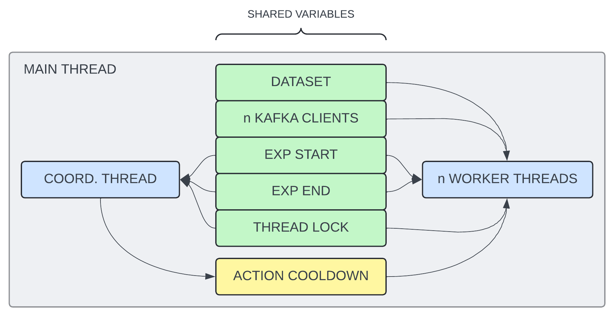

## Overview

- A multi-threaded `Python` script that controls the interval at which data is fed into a `Kafka` topic.
    - The data itself is read from a `HDFS` dataset, consisting of serialized image matricies.
- The feeding methodology is based on a realistic 24h traffic cycle.
    - Peaks around 08 and 17, and then gradually tapering off.
        - Each hour is represented by a workload percentage value.
        - The percentages are scaled based on a maximum throughput value, defined as an input parameter.
    - The default 24h cycle can be stretched to `n` values, resulting in a smoother curve.
- A full experiment can consist of multiple repeated 24h cycles.
    - The temporal duration for each cycle is scaled based on the experiment's duration.

<!-- ########################################################################################################## -->
## Table of Contents

1. [Input Parameters](#)
2. [24H day/night cycle](#)
    1. [Default cycle](#)
    2. [Stretched cycle](#)
3. [Feeding logic](#)
    1. [Main thread](#)
    2. [Coordinating thread](#)
    3. [Worker threads](#)

<!-- ########################################################################################################## -->
## Input Parameters

1. `--max_mbps` (`int`): What the maximum cumulative MB/s of the script should be.
    - All workloads are scaled by a percentage of this value.
    - If this value is too high, the cluster will gradually fall behind.
        - In my experience, the `NUC` cluster's limit is roughly `15.5 MB/s`.
2. `--duration` (`int`): The duration of the experiment defined in seconds.
3. `--breakpoints` (`int`): How many breakpoints the 24h day-night cycle should contain.
    - With 24 breakpoints, the workload can change quite drastically all of a sudden.
    - Stretching the same cycle to `~200` breakpoints results in a smooth curve.
    - Keep in mind that `Kubernetes` is quite slow (max 15s) at reacting to changes in workload.
4. `--n_cycles` (`int`): How many day-night cycles should be repeated.
    - We generally used 5-6 cycles to see if the cluster's behaviour stays the same.

```bash
# FOR EXAMPLE
python3 app/feeder.py
    --max_mbps 15
    --duration 7200
    --breakpoints 200
    --n_cycles 6
```

<!-- ########################################################################################################## -->
## 24H DAY-NIGHT CYCLE

- 24 percentage values, each representying the workload % of that hour.
    - [`/app/feeder.py row98`](/app/feeder.py#row98)
- By setting `>24` breakpoints, the array is stretched with `np.linspace` and `np.interp`
    - The same ratios are roughly maintained.
    - [`/app/utilz/misc.py row115`](/app/utilz/misc.py#row115)
- This essentially just smoothens the curve of the workload growing/shrinking.
    - Arguably makes the traffic data more realistic.
    - Allows kubernetes to scale more gradually.

#### DEFAULT CYCLE
```python
# DEFAULT: 24 BREAKPOINTS
[
    0.03,   0.06,   0.09,   0.12,   0.266,  0.412,
    0.558,  0.704,  0.85,   0.7625, 0.675,  0.587,
    0.5,    0.59,   0.68,   0.77,   0.86,   0.97,
    0.813,  0.656,  0.5,    0.343,  0.186,  0.03
]
```

#### STRETCHED CYCLE
```python
# STRETCHED TO 48 BREAKPOINTS
[
    0.03,   0.0447, 0.0594, 0.074,  0.0887, 0.1034,
    0.1181, 0.1821, 0.2536, 0.325,  0.3965, 0.4679,
    0.5394, 0.6108, 0.6823, 0.7537, 0.8251, 0.8221,
    0.7793, 0.7364, 0.6936, 0.6507, 0.6076, 0.5648,
    0.5222, 0.5211, 0.5651, 0.6091, 0.6532, 0.6972,
    0.7413, 0.7853, 0.8294, 0.8764, 0.9302, 0.95,
    0.8731, 0.7963, 0.7195, 0.6427, 0.5664, 0.49,
    0.4131, 0.3363, 0.2595, 0.1827, 0.1063, 0.03
]
```

<!-- ########################################################################################################## -->
## FEEDING LOGIC

<p align="center">
    
</p>

<!-- ########################################################################################################## -->
### MAIN THREAD
---

1. Load the traffic dataset in [`/app/datasets/mini.hdf5`](/app/datasets/mini.hdf5).
2. Create `n` Kafka producer clients.
3. Generates a start and end timestamp for the experiment (`now+3sec`).
4. Initialize the `action_cooldown`.
5. Creates a shared thread lock.
    - If/when the main thread dies, this object will kill the other threads gracefully.
6. Creates `n` worker threads. 
7. Creates a coordinating thread.
8. Wait for both thread types to die.

<!-- ########################################################################################################## -->
### COORDINATING THREAD
---

1. Computes how long each breakpoint segment is.
    - `(n_breakpoints * n_cycles) / experiment_duration`
2. Perform one event loop, then wait until the experiment starts.
2. Event loop:
    1. Select the next breakpoints mb/s interval.
    2. Compute how many actions per thread per second the interval requires.
        - `events_per_second = (mbps_interval * 10**6) / avg_dataset_item_size`
        - `new_cooldown = (1 / (events_per_second / num_threads))`
        - [`/app/feeder.py row137`](/app/feeder.py#r137)
    3. Update the `action_cooldown` to reflect this.
    4. Wait until the next breakpoint.
    5. Repeat until the experiment ends.

<!-- ########################################################################################################## -->
### WORKER THREADS
---

1. Selects a random starting index (`next_index`) from the dataset.
2. Select its designated `Kafka` producer client.
2. Wait until the experiment starts.
3. Event loop:
    1. Measure when action started.
    2. Push dataset row into a random `Kafka` partition of the `yolo_input` topic.
    3. Wait for acknowledge.
    4. Increment `next_index` using modulo operation.
    5. Read the latest `action_cooldown`.
    5. Measure when action finished and compute the `action_duration`.
    6. Sleep for a brief period of time.
        - `adjusted_cooldown = max(action_cooldown - action_duration, 0)`
        - [`/app/feeder.py row181`](/app/feeder.pyr181`)
    7. Repeat until the experiment ends.

<!-- ## EVENT LOOP

1. Load the traffic dataset in [`/app/datasets/mini.hdf5`](/app/datasets/mini.hdf5) into memory.
2. Create `n` Kafka producer clients.
4. Generate a shared timestamp for when the experiment starts (`now+3sec`)
3. Create `n` worker threads.
    - Each thread:
        1. Selects a random starting index (`next_index`) from the dataset.
        2. Waits until the experiment starts.
5. Unique thread event loop:
    1. Measure when action started.
    2. Push dataset row into a random `Kafka` partition of the `yolo_input` topic.
    3. Wait for acknowledge.
    4. Increment `next_index`.
    5. Measure when action finished and compute the `action_duration`.
    6. Sleep for `action_cooldown - action_duration`.
    7. Repeat until manually killed. -->